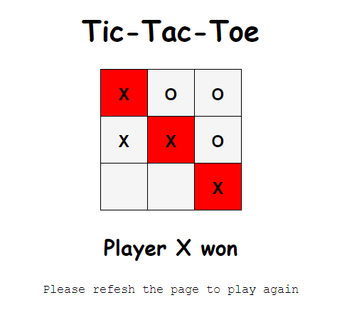

# Tic-tac-toe-Game

We all have played the tic-tac-toe game in our childhood. I tried to created this game using HTML, CSS and Javascript.
It's currently a Player vs Player game, i will try to add player vs computer mode in the future.

# How to play

As it is a Player vs player game, so two players should be there. (X) will be the player 1 and (O) will be the player 2.
All the codes are written in a single HTML document, so only a browser is required to run this file. Download this document and open
it with any browser, Or Play it here :-
 https://rahulranjan14.github.io/Tic-tac-toe-Game/
Once the game is over, refresh the page to play again.

# Added features

1. The winning path will get colored now. Player X's winning path will be colored as red and player O's winning path will be colored as Blue.
2. No more clicks will be valid after a player wins.

# Preview

